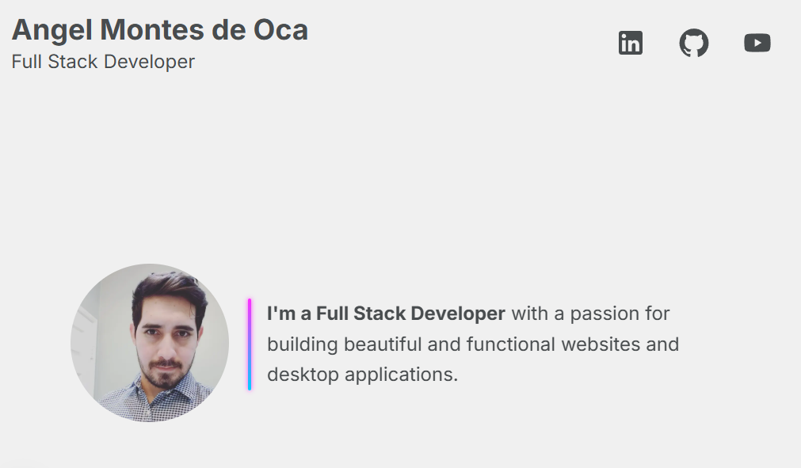

# 🧠 Angel Montes de Oca - Personal Portfolio

This is my personal portfolio built with [Next.js](https://nextjs.org/), CSS Modules, and a responsive layout. It showcases my skills, work experience, and featured projects as a Full Stack Developer.

> 🎯 Designed with performance, accessibility, and modern frontend practices in mind.

---

## 🚀 Tech Stack

- **Framework:** Next.js 16 (App Router)
- **Styling:** CSS Modules + custom responsive design
- **UI:** Native HTML/CSS

---

## 📂 Features

- 📱 Fully responsive and mobile-friendly
- 📁 Dynamic sections: Skills, Experience, Projects
- 📄 Downloadable resume link

---

## 🧪 Linting

Run the linter with:

```bash
npm run lint
```


## 📸 Preview



---

## 🛠 Getting Started

This project is built with Node.js; Node 20 LTS or later is recommended.

Install dependencies:

```bash
npm install
```

Run the dev server:

```bash
npm run dev
```

Then open [http://localhost:3000](http://localhost:3000)


## 👨‍💻 Contact

Connect with me on:

- [LinkedIn](https://www.linkedin.com/in/angelmontesdev/)
- [GitHub](https://github.com/joesatriani10)
- [YouTube](https://www.youtube.com/@AngelMontesdeOca)

---

## 📄 License

MIT
